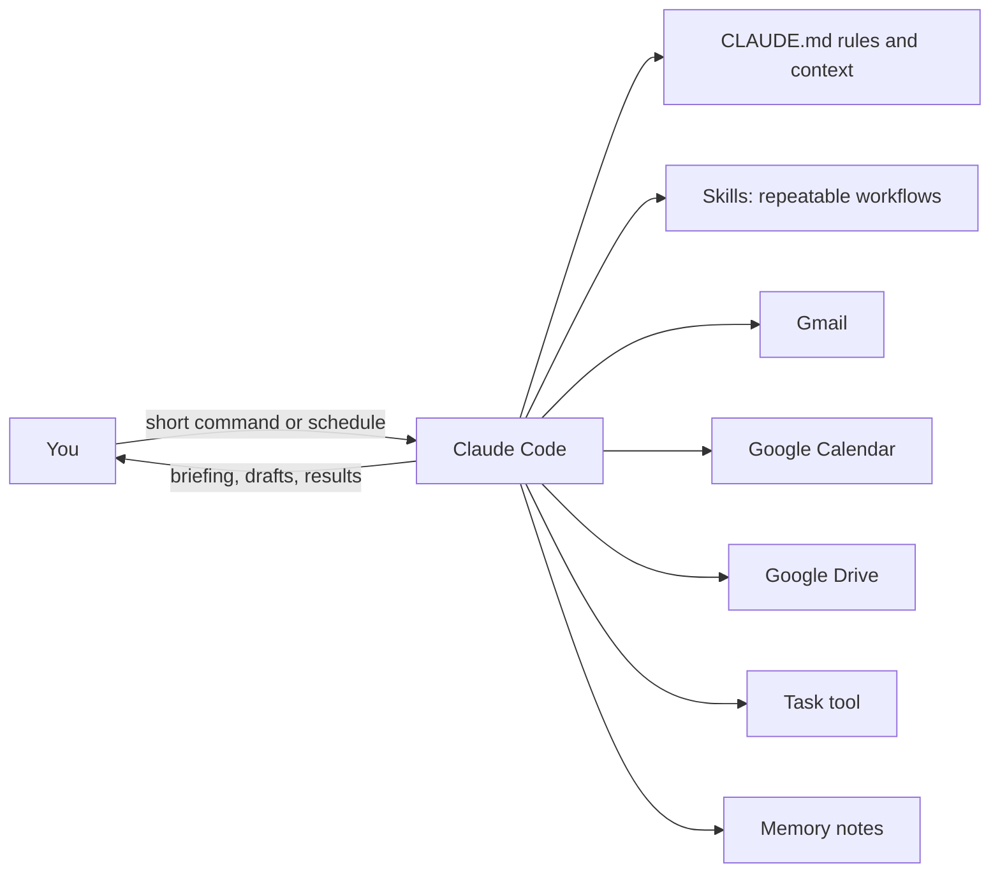

# Case Study 1: AI Executive Assistant

**Status:** Sample design. Demo scenario, not client work.

## The problem
A busy owner spends hours every day on email, scheduling, and tracking tasks. Nothing is broken. It is just slow, and it never ends.

## The solution
An AI executive assistant built on Claude Code. It connects to the tools you already use and runs repeat tasks from short commands or on a schedule.

## What it does
- Drafts email replies in your voice for you to approve
- Checks your calendar and proposes meeting times
- Sends a morning briefing: today's meetings, open tasks, and unread priority emails
- Logs completed tasks and reminds you of unfinished ones
- Follows written rules, so it gets more accurate over time

## How it works

## The building blocks
- **Rules file:** who you are, how you work, your tone, and your priorities.
- **Skills:** one file per repeat workflow, such as the morning briefing.
- **Connectors (MCP):** secure links to Gmail, Calendar, Drive, and your task tool.
- **Memory:** notes the assistant keeps so you do not repeat yourself.

## Tools
Claude Code, MCP connectors, Gmail, Google Calendar, Google Drive, ClickUp

## What a client gets
- A working assistant set up on their account
- Their own rules file and 3 to 5 starter skills
- A one-page guide so they can run it without me
- A support call after the first week
