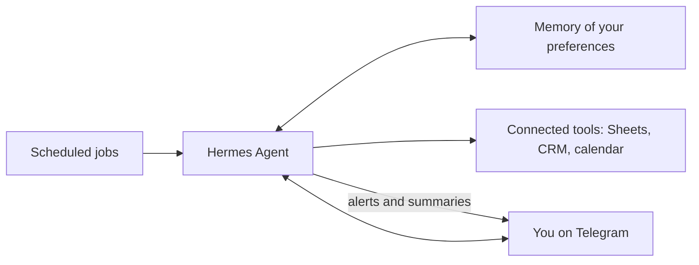

# Case Study 2: Personal AI Agent with Hermes Agent

**Status:** Sample design. Demo scenario, not client work.

## The problem
Owners want an assistant that works while they are away from the computer. It should remember context, run jobs on a schedule, and reach them on their phone.

## The solution
A personal AI agent built with Hermes Agent. It runs in the background, keeps a memory of your preferences, runs scheduled jobs, and sends you messages on Telegram.

## What it does
- Sends a daily summary at a set time
- Runs recurring checks, such as new leads or overdue invoices, and alerts you only when something needs you
- Answers quick questions from your phone
- Remembers your preferences, so you do not repeat yourself

## How it works

## Design rules I follow
- **Alert on exceptions, not on everything.** You only get a message when something needs you.
- **Approve before sending.** Anything that goes to a customer waits for your OK at first.
- **Keep secrets out of prompts.** Keys live in a protected settings file, never in chat.
- **Reliable over fast.** A job that runs correctly every time beats a fast one that fails sometimes.

## Tools
Hermes Agent, Telegram, Google Sheets, scheduled jobs (cron)

## What a client gets
- The agent installed and running
- 2 to 3 scheduled jobs set up for their routine
- A short guide for changing the schedule and rules
