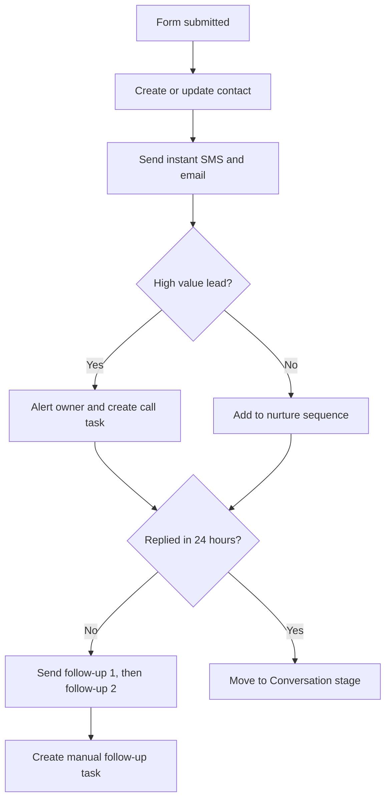

# Case Study 3: Lead Follow-Up Automation

**Status:** Sample design in GoHighLevel. Demo scenario, not client work. The routing logic is built and tested in n8n. See [Case Study 5](05-form-to-alert-n8n.md).

## The problem
Leads go cold because nobody follows up fast enough. Speed matters. The first business to reply usually wins.

## The solution
A workflow that reacts the moment a lead comes in. It replies instantly, sorts the lead by priority, and makes sure a person follows up if the lead does not answer.

## Flow

## Key details
- **Speed to lead:** the first message goes out within a minute, at any hour
- **Tags:** the source, the service, and the priority are added automatically
- **Pipeline stage:** moves on its own when the lead replies or books
- **Quiet hours:** no SMS late at night
- **Stop rule:** the sequence stops when the lead replies or books a call

## Tools
GoHighLevel, Google Sheets, optional Zapier or n8n for outside apps

## What a client gets
- The workflow built and tested with a test contact
- Message templates written in their voice
- A simple report of leads by source and priority
