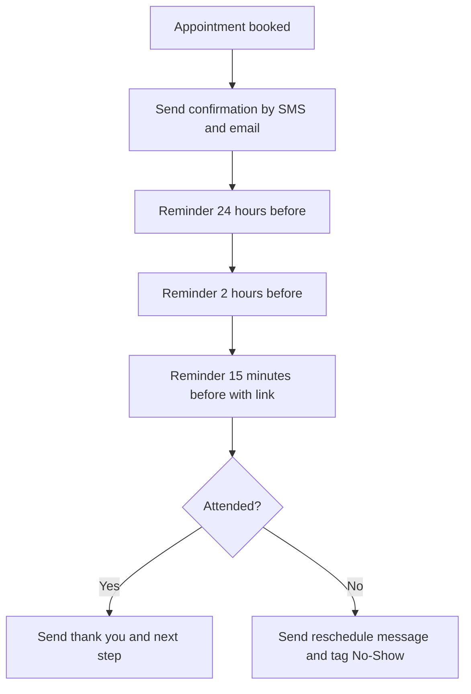

# Case Study 4: Appointment Reminder Flow

**Status:** Sample design in GoHighLevel. Demo scenario, not client work.

## The problem
No-shows waste time and money. Most people are not being rude. They forgot.

## The solution
Automatic reminders that go out before every booked call or visit. The person can confirm or reschedule with one reply.

## Flow

## Key details
- **Two channels:** SMS and email, so at least one gets seen
- **One-tap reschedule:** every reminder has a link
- **Time zones:** times are shown in the guest's time zone
- **Rules for cancels:** if the guest cancels, the reminders stop
- **No-show tag:** makes follow-up and reporting easy

## Tools
GoHighLevel, Google Calendar

## What a client gets
- The reminder flow built and tested
- Message wording in their voice
- A count of no-shows before and after, so the result can be seen
