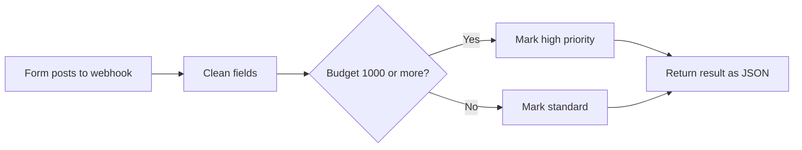

# Case Study 5: Form to Sheet to Alert (n8n)

**Status:** Built and tested end to end. Demo data, not client work.

## The problem
Form data gets copied by hand into a sheet, and somebody has to remember to tell the right person.

## The solution
Every form submission is cleaned, sorted by priority, and returned in one step. In a real setup, it is also logged to a Google Sheet and an alert goes to the right person.

## Flow

## Test results
Tested on n8n 2.22.5 with sample leads.

| Input | Result |
|---|---|
| Budget 2500 | priority `high`, next step "Notify owner now and book a call within 1 hour" |
| Budget 300 | priority `standard`, next step "Send welcome email and add to nurture sequence" |
| Email `Ana@Example.com` | cleaned to `ana@example.com` |

## Extending it for a client
Add a Google Sheets node to log each lead, and a Telegram, Slack, or Email node to alert the owner. I set up the connections and credentials.

## Tools
n8n, Google Sheets, Telegram or Slack
