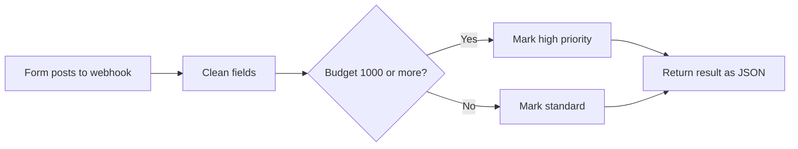

# Case Study 5: N8N Automations for Google Form and Sheets

**Status:** The routing logic is built and tested end to end with sample leads. Demo data, not client work. The Google Form and Google Sheets connections are set up per client.

**Typical price range:** $100 to $200 | **Typical duration:** 1 to 7 days

## The problem
Form data gets copied by hand into a sheet, and somebody has to remember to tell the right person.

## What I built
An n8n workflow that receives each form submission, cleans the name and email, and sorts the lead by priority. Leads with a budget of $1,000 or more are marked high priority and flagged for a call within the hour. Everyone else is marked standard. The result is returned in one step.

## Flow

## Tested
Tested on n8n 2.22.5 with sample leads.

| Input | Result |
|---|---|
| Budget 2500 | priority `high`, next step "Notify owner now and book a call within 1 hour" |
| Budget 300 | priority `standard`, next step "Send welcome email and add to nurture sequence" |
| Email `Ana@Example.com` | cleaned to `ana@example.com` |

## Can be extended with
Google Form as the form source, Google Sheets logging, and alerts on Telegram, Slack, or email, so the right person is told right away.

## Tools
n8n, Webhooks, Google Forms (optional), Google Sheets (optional), Telegram or Slack (optional)
