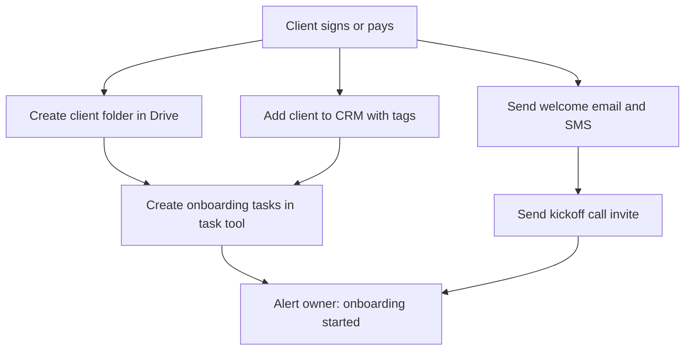

# Case Study 6: Client Onboarding Workflow

**Status:** Sample design. Demo scenario, not client work.

## The problem
Every new client needs the same 10 steps: folder, welcome message, CRM entry, tasks, and calendar invites. Doing them by hand takes time and steps get missed.

## The solution
One trigger, such as a paid invoice or a signed agreement, starts the whole checklist. Nothing is forgotten.

## Flow

## Key details
- **One trigger:** nothing to remember to start
- **Same checklist every time:** no missed steps
- **Folder template:** subfolders are created automatically
- **Dates:** task due dates are set relative to the start date
- **Owner alert:** one short message when everything is done

## Tools
Zapier or Make, GoHighLevel, Google Drive, Google Calendar, ClickUp

## What a client gets
- The workflow built and tested with a dummy client
- Their folder template and welcome messages
- A one-page checklist showing what runs automatically
